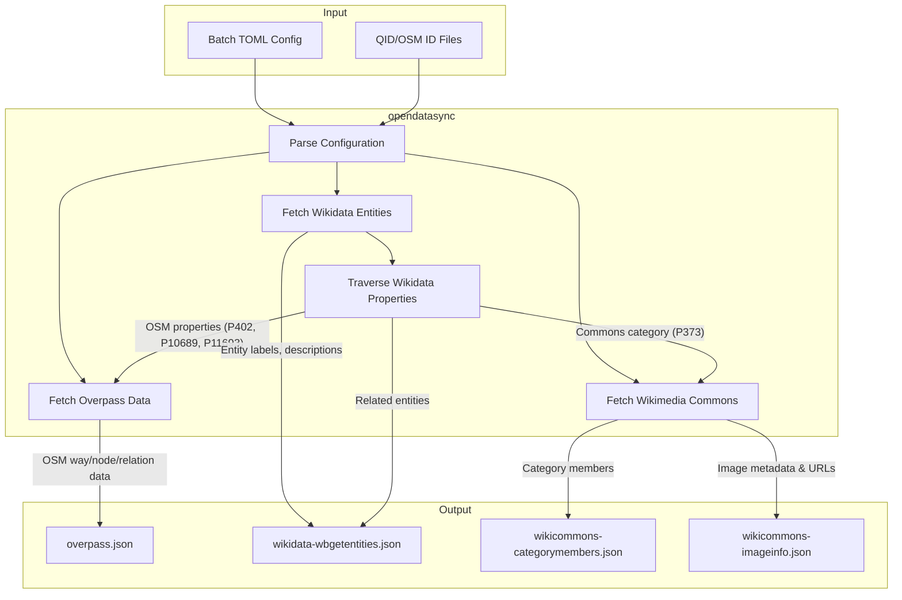

# opendatasync

A command-line utility for synchronizing open data from OpenStreetMap (Overpass API), Wikidata, and Wikimedia Commons. Designed for static site generation workflows that need to fetch and cache structured data from multiple open data sources.

**Repository**: [codeberg.org/houston-open-source-society/opendatasync](https://codeberg.org/houston-open-source-society/opendatasync)

## Purpose

This tool fetches data from open data APIs and outputs structured JSON/CSV files for consumption by static site generators or other tools. It's particularly useful for building websites that display information about places, organizations, or media from authoritative open data sources.

This tool is part of the [Houston Open Source Society (HOSS)](https://houstonopensourcesociety.com) build pipeline. See the [HOSS website architecture documentation](https://codeberg.org/houston-open-source-society/website/src/branch/main/docs/ARCHITECTURE.md) for details on how `opendatasync` integrates with the static site generation workflow.

## Installation

```bash
cargo build --release
```

The binary will be available at `target/release/opendatasync`.

### Developer Setup

After cloning the repository, install the git hooks to enable version validation:

```bash
git config core.hooksPath .githooks
```

This installs a pre-push hook that validates `Cargo.toml` version matches git tags before pushing, preventing version synchronization errors.

## Architecture

### Data Flow



### Key Features

- **Overpass API**: Fetches OpenStreetMap data for buildings, venues, and locations
- **Wikidata API**: Retrieves entity information with property traversal
- **Wikimedia Commons**: Downloads image metadata and category information
- **HTTP caching**: Minimizes API requests using disk-based cache
- **Batch processing**: Process multiple data sources in one operation
- **Property traversal**: Automatically follow Wikidata relationships to discover related entities

## Usage

The utility provides three main commands: `wikidata`, `wikicommons`, `overpass`, and `batch`.

### Global Options

These options can be used with any subcommand:

- `--verbose` - Enable verbose logging
- `--output-dir <DIR>` - Output directory for saving results to files
- `--cache-dir <DIR>` - Cache directory for storing API responses (default: `./cache`)

### Wikidata: Get Entities

Fetch Wikidata entities with optional property resolution and traversal.

```bash
opendatasync wikidata wbgetentities --qid Q30 --qid Q1342
```

**Options:**

- `-q, --qid <QID>` - Wikidata QID(s) to fetch (can be specified multiple times)
- `--ids-from-file <FILE>` - Read QIDs from a file (one per line, `#` for comments)
- `-f, --format <FORMAT>` - Output format: `csv` or `json` (default: `csv`)
- `--resolve-headers <MODE>` - Resolve property IDs to names in headers: `none`, `all`, `select` (default: `all`)
- `--select-header <PID>` - Specific header properties to resolve (required with `--resolve-headers=select`)
- `--resolve-data <MODE>` - Resolve data property values to names: `none`, `all`, `select` (default: `all`)
- `--select-data <PID>` - Specific data properties to resolve (required with `--resolve-data=select`)
- `--keep-qids` - Keep QID columns alongside resolved names (default: `true`)
- `--keep-filename` - Keep filename columns for Commons media (default: `false`)
- `--only-values` - In JSON output, prune non-value fields (default: `true`)
- `--preserve-qualifiers-for <PID>` - When `--only-values` is true, preserve qualifiers for these specific properties (e.g., P6375, P969). Properties in this list will always use object format `{"value": ..., "qualifiers": {...}}` for consistent parsing, even when qualifiers are empty
- `--traverse-properties <PID>` - Recursively follow and fetch entities referenced by these properties
- `--traverse-osm` - Shortcut to traverse OSM properties (P402, P10689, P11693) (default: `true`)
- `--traverse-commons` - Traverse Commons category (P373) and fetch members (default: `true`)
- `--traverse-commons-depth <DEPTH>` - Depth: `category` (members only) or `page` (members + imageinfo) (default: `page`)

**Examples:**

```bash
# Fetch entity with full resolution (default)
opendatasync wikidata wbgetentities --qid Q30

# Fetch multiple entities from file
opendatasync wikidata wbgetentities --ids-from-file wikidata_qids.txt --format json

# Selective property resolution
opendatasync wikidata wbgetentities --qid Q84 \
  --resolve-headers select --select-header P31 --select-header P17 \
  --resolve-data select --select-data Q6256 --select-data Q515

# Traverse specific Wikidata properties
opendatasync wikidata wbgetentities --qid Q30 \
  --traverse-properties P527 --traverse-properties P361

# Preserve qualifiers for specific properties in JSON output
opendatasync wikidata wbgetentities --qid Q30 \
  --format json --only-values \
  --preserve-qualifiers-for P6375 --preserve-qualifiers-for P969
```

### Wikidata: Get Claims

Fetch claims (statements) for a specific Wikidata entity and property.

```bash
opendatasync wikidata wbgetclaims --entity Q30 --property P36
```

**Options:**

- `-e, --entity <QID>` - Entity QID
- `-p, --property <PID>` - Property ID
- `-f, --format <FORMAT>` - Output format: `csv` or `json` (default: `csv`)

### Wikicommons: Category Members

Fetch members of Wikimedia Commons categories.

```bash
opendatasync wikicommons categorymembers --category "Category:Houston, Texas"
```

**Options:**

- `-c, --category <NAME>` - Category name(s) (can be specified multiple times)
- `--ids-from-file <FILE>` - Read categories from file (one per line)
- `--traverse-pageid` - Fetch detailed imageinfo for each page (default: `false`)
- `--recurse-subcategory-pattern <REGEX>` - Recursively fetch subcategories matching pattern
- `-f, --format <FORMAT>` - Output format: `csv` or `json` (default: `csv`)

**Examples:**

```bash
# Fetch category members
opendatasync wikicommons categorymembers --category "Category:Houston, Texas"

# Recursively fetch subcategories
opendatasync wikicommons categorymembers \
  --category "Bayland Community Center, Houston" \
  --recurse-subcategory-pattern "Houston Open Source Society" \
  --traverse-pageid
```

### Wikicommons: Image Info

Fetch detailed image information for specific page IDs.

```bash
opendatasync wikicommons imageinfo --pageid 12345 --pageid 67890
```

**Options:**

- `-p, --pageid <ID>` - Page ID(s) (can be specified multiple times)
- `--ids-from-file <FILE>` - Read page IDs from file (one per line)
- `-f, --format <FORMAT>` - Output format: `csv` or `json` (default: `csv`)

### Overpass: Query OpenStreetMap

Fetch OpenStreetMap elements by ID via Overpass API.

```bash
opendatasync overpass query --way 56065095 --node 123456789
```

**Options:**

- `--node <ID>` - OSM node ID(s)
- `--way <ID>` - OSM way ID(s)
- `--relation <ID>` - OSM relation ID(s)
- `--ids-from-file <FILE>` - Read OSM IDs from file (format: `node/123`, `way/456`, `relation/789`)
- `--bbox` - Bounding box filter: `south,west,north,east`
- `--timeout <SECONDS>` - Query timeout (default: 25)
- `-f, --format <FORMAT>` - Output format: `csv` or `json` (default: `json`)

**Examples:**

```bash
# Fetch mixed element types
opendatasync overpass query --way 56065095 --node 123456789 --relation 456789123

# Fetch with bounding box
opendatasync overpass query --way 111222333 --bbox 40.0,-80.0,40.5,-79.5

# Load from file
opendatasync overpass query --ids-from-file osm_ids.txt
```

### Batch: Process Multiple Sources

Process multiple data sources from a single batch file.

```bash
opendatasync batch --batch-file batch.toml
```

**Batch File Format:**

The batch file is in TOML format and can contain multiple `[[wikidata]]`, `[[wikicommons]]`, and `[[overpass]]` entries.

**Example batch.toml:**

```toml
# Wikidata entities
[[wikidata]]
qids = ["Q30", "Q1342", "Q16"]
resolve_headers = "all"
resolve_data = "all"
traverse_osm = true
only_values = true
preserve_qualifiers_for = ["P6375", "P969"]

[[wikidata]]
ids_from_file = "./wikidata_qids.txt"

# Wikimedia Commons
[[wikicommons]]
[wikicommons.categorymembers]
categories = ["Category:Houston, Texas", "Category:Pittsburgh"]
traverse_pageid = true

[[wikicommons]]
[wikicommons.categorymembers]
categories = ["Bayland Community Center, Houston"]
recurse_subcategory_pattern = "Houston Open Source Society"
traverse_pageid = true

# OpenStreetMap data
[[overpass]]
nodes = [123456789, 987654321]
ways = [56065095, 12345678]
relations = [456789123]
timeout = 25

[[overpass]]
ids_from_file = "./osm_ids.txt"
```

See [example_batch.toml](example_batch.toml) for a complete example.

**Running batch mode:**

```bash
# Process batch file with caching
opendatasync --cache-dir ./cache --output-dir ./data batch --batch-file batch.toml

# With verbose logging
opendatasync --verbose --cache-dir ./cache --output-dir ./data batch --batch-file batch.toml
```

Batch mode outputs separate JSON files for each data source type:
- `wikidata-wbgetentities.json`
- `wikidata-wbgetclaims.json`
- `wikicommons-categorymembers.json`
- `wikicommons-imageinfo.json`
- `overpass.json`

## Podman Usage

This tool is also available as a Podman image for use in CI/CD pipelines and containerized environments:

```bash
# Pull the latest image
podman pull codeberg.org/houston-open-source-society/opendatasync:latest

# Run with batch file
podman run --rm -v $(pwd):/data \
  codeberg.org/houston-open-source-society/opendatasync:latest \
  --cache-dir /data/cache --output-dir /data/output \
  batch --batch-file /data/batch.toml

# Run single command
podman run --rm \
  codeberg.org/houston-open-source-society/opendatasync:latest \
  wikidata wbgetentities --qid Q30 --format json
```

The Podman image is automatically built and published via Forgejo Actions on every tagged release.

## Integration with Houston Open Source Society Website

This tool is used in the [HOSS website](https://houstonopensourcesociety.com) build pipeline to fetch open data about venues, organizations, and media. The workflow is:

1. **Content Scanning**: The site's `gather.sh` script scans markdown files for Wikidata QIDs and OSM IDs
2. **Data Generation**: During the build process, `opendatasync` processes the batch file and fetches data from APIs
3. **Site Integration**: Zola (the static site generator) loads the JSON data using `load_data()`, making it available to templates
4. **Display**: Templates display venue information, images, and entity details with full data from authoritative sources

For detailed information about the complete data pipeline and integration examples, see the [HOSS Architecture Documentation](https://codeberg.org/houston-open-source-society/site/src/branch/main/docs/ARCHITECTURE.md).

## Dependencies

- `clap` - Command-line argument parsing with derive macros
- `thiserror` - Ergonomic error handling
- `reqwest` / `reqwest-middleware` / `reqwest-tracing` - HTTP client with middleware support
- `serde` / `serde_json` - JSON serialization
- `csv` - CSV output formatting
- `toml` - Batch configuration file parsing
- `tokio` - Async runtime
- `tracing` / `tracing-subscriber` - Structured logging

## Building

This project uses Rust 2024 edition. To build:

```bash
cargo build --release
```

The release profile is optimized for size with LTO, single codegen unit, and symbol stripping enabled.

## Release Workflow

This project maintains version synchronization across three systems:
1. **Cargo.toml** - Source version for the binary
2. **Git tags** - Release version markers
3. **Container images** - Published with matching version tags

### Creating a Release

To create a new release:

1. **Update the version** in `Cargo.toml`:
   ```toml
   [package]
   version = "0.2.0"
   ```

2. **Commit the version change**:
   ```bash
   git add Cargo.toml
   git commit -m "chore: bump version to 0.2.0"
   ```

3. **Create a matching git tag**:
   ```bash
   git tag v0.2.0
   ```

4. **Push both commit and tag**:
   ```bash
   git push && git push --tags
   ```

### Automated Release Process

When you push a tag:

1. **Pre-push hook** validates that `Cargo.toml` version matches the tag
2. **CI workflow** (`.forgejo/workflows/ci.yml`) is triggered and:
   - Re-validates version match (defense in depth)
   - Runs formatting checks, clippy, and tests
   - Builds the Rust binary with the correct version
   - Verifies `opendatasync --version` shows the correct version
   - Builds container image with two tags:
     - `codeberg.org/houston-open-source-society/opendatasync:0.2.0` (version-specific)
     - `codeberg.org/houston-open-source-society/opendatasync:latest` (latest release)
   - Pushes images to Codeberg container registry

### Version Validation

The project uses a **layered defense** approach:

- **Local git hook** (`.githooks/pre-push`): Catches version mismatches before pushing tags
- **CI validation**: Double-checks version match in the release workflow
- **Binary verification**: Confirms the built binary reports the correct version

If validation fails at any stage, the release process stops and no artifacts are published.

### Example Release Output

After a successful release, you'll have:
- Git tag: `v0.2.0`
- Binary version: `opendatasync 0.2.0`
- Container images:
  - `codeberg.org/houston-open-source-society/opendatasync:0.2.0`
  - `codeberg.org/houston-open-source-society/opendatasync:latest`

## Related Projects

- **[rrule-calc](https://codeberg.org/houston-open-source-society/rrule-calc)** - Companion tool that generates recurring event schedules from iCalendar RRULE specifications
- **[HOSS Website](https://codeberg.org/houston-open-source-society/website)** - Static site built with Zola that uses both `opendatasync` and `rrule-calc` in its [build pipeline](https://codeberg.org/houston-open-source-society/website/src/branch/main/.forgejo/workflows)

## License

Copyright © 2025 Evan Carroll

This software is licensed under the Anti-Capitalist Software License (v 1.4).

See [LICENSE.md](LICENSE.md) for full license text, or visit https://anticapitalist.software/
